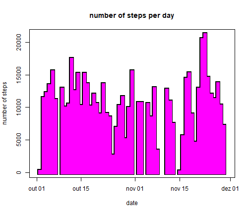
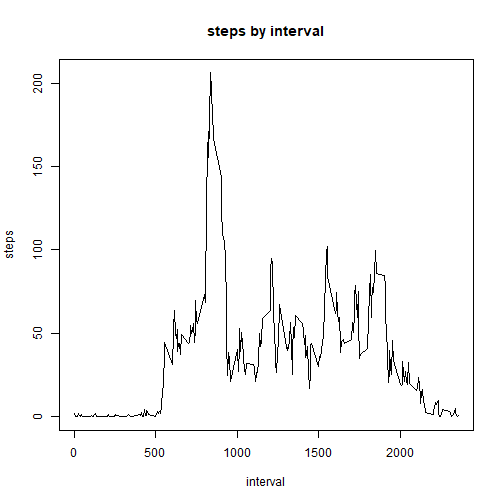
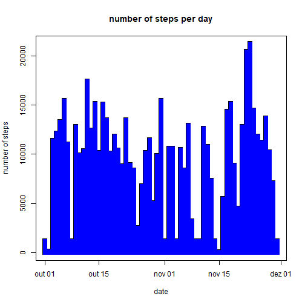
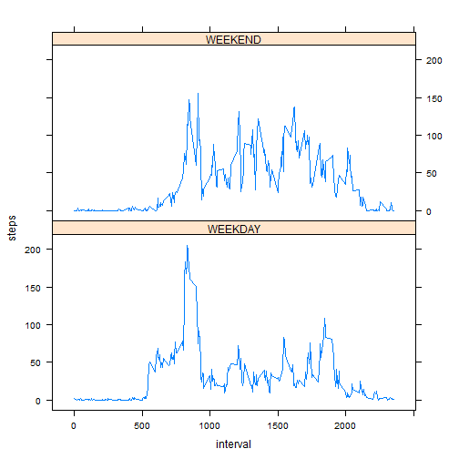

# Pesquisa Reproduzível: Analisando um monitor de passos de uma pessoa. 

### A importância

A pesquisa que permite ser reproduzida traz algumas vantagens:

1. O aprendizado. Quando nos deparamos com uma pesquisa reproduzível, podemos apredender e aplicar a mesma técnica para outras situações;
2. A refutabilidade. Um dos pontos que separam a ciência de outras crenças é que ela pode ser refutável. Podemos discordar da amostra obtida, do método de coleta de dados, das transformações dos dados, ou ainda das conclusões; 
2. A sua evolução. Outras pessoas podem testar e aplicar a mesma pesquisa a outros cenários, à outras amostras e assim descobrir falhas ou lacunas que levarão à evolução desta pesquisa.

### Amostra 

Para essa tarefa, usaremos os dados de um dispositivo de monitoramento de atividades pessoais. Este dispositivo coleta dados a cada 5 minutos ao longo do dia. Os dados consistem em dois meses de dados de um indivíduo anônimo coletado ao longo de alguns meses e o número de passos dados em intervalos de 5 minutos por dia.

### Carregando e pré-processando os dados

Neste primeiro bloco, vamos carregar os dados e processá-los conforme necessário. O uso do código para este exercício é:


```r
library(data.table)
```

```
## Warning: package 'data.table' was built under R version 3.2.5
```

```
## data.table 1.10.4
```

```
##   The fastest way to learn (by data.table authors): https://www.datacamp.com/courses/data-analysis-the-data-table-way
```

```
##   Documentation: ?data.table, example(data.table) and browseVignettes("data.table")
```

```
##   Release notes, videos and slides: http://r-datatable.com
```

```r
Originais <- fread("activity.csv")
Originais$date <- as.Date(Originais$date, "%Y-%m-%d")
```


O código é lido com a função "fread" do pacote data.table. O único processamento aplicado ao conjunto de dados é a transformação da variável de dados de Caractere para Data.


Das funções básicas do R, podemos destacar summary e head. A primeira traz informações que já podem indicar algum procedimento que será necessário fazer. A função head traz os primeiros registros, que podem ajudar a visualizar a nossa amostra. 


```r
summary(Originais)
```

```
##      steps             date               interval     
##  Min.   :  0.00   Min.   :2018-10-01   Min.   :   0.0  
##  1st Qu.:  0.00   1st Qu.:2018-10-16   1st Qu.: 588.8  
##  Median :  0.00   Median :2018-10-31   Median :1177.5  
##  Mean   : 37.38   Mean   :2018-10-31   Mean   :1177.5  
##  3rd Qu.: 12.00   3rd Qu.:2018-11-15   3rd Qu.:1766.2  
##  Max.   :806.00   Max.   :2018-11-30   Max.   :2355.0  
##  NA's   :2304
```

```r
head(Originais)
```

```
##    steps       date interval
## 1:    NA 2018-10-01        0
## 2:    NA 2018-10-01        5
## 3:    NA 2018-10-01       10
## 4:    NA 2018-10-01       15
## 5:    NA 2018-10-01       20
## 6:    NA 2018-10-01       25
```

```r
length(Originais$steps)
```

```
## [1] 17568
```
Algumas observações: 

- Através destas funções vemos que temos o número de passos (steps) com mínimo e mediana zerados, ou seja, há muitos momentos em que a pessoa não caminha ou ainda possa ter alguma imperfeição na coleta dos dados;

- Porém, temos um total de 17568 amostras frente às 2304 amostras sem medidas (NA). Levando em conta que o equipamento pode não ter funcionado o tempo todo e que foram agrupadas as medidas a cada 5 minutos, me parece válido o intervalo obtido;

- As datas variam de 01/Out até 30/Nov, o que equivale a 2 meses;

- A coluna interval varia de 0 até 2355, o que corresponde ao horário medido, ou seja, de 00:00 a 23:55. 


## Qual é o número total médio de passos dados por dia?

Neste exercício, geraremos um histograma do número total de etapas realizadas por dia e calcularemos o número médio de etapas realizadas por dia. 

Neste bloco, os valores de NA podem ser ignorados.


```r
Passos <- Originais[, lapply(.SD, sum), by = date, .SDcols = "steps"]

par(lend = "square")

plot(Passos$date, Passos$steps, 
     type = "h", lwd = 10, col = "black", 
     xlab = "date", ylab = "number of steps",
     main = "number of steps per day")

lines(Passos$date, Passos$steps, type = "h", lwd = 7, col = "magenta")
```



```r
mean(Passos$steps, na.rm = T);median(Passos$steps, na.rm = T)
```

```
## [1] 10766.19
```

```
## [1] 10765
```

## Qual é o padrão de atividade média diária?

Faremos uma série de tempos do intervalo de 5 minutos (eixo x) e o número médio de passos realizados, calculando a média todos os dias. Descubra qual intervalo de 5 minutos, em média, para todos os dias no conjunto de dados, contém o número máximo de etapas.


```r
Passos2 <- Originais[!is.na(Originais$steps)][,lapply(.SD, mean), by = interval, .SDcols = "steps"]

plot(Passos2$interval, Passos2$steps, type = "l", 
     xlab = "interval", ylab = "steps", 
     main = "steps by interval")
```



```r
Passos2[which.max(Passos2$steps)]
```

```
##    interval    steps
## 1:      835 206.1698
```

## Inserindo valores ausentes

Vamos calcular o número total de valores omissos no conjunto de dados. Vamos elaborar uma estratégia para preencher todos os valores ausentes no conjunto de dados. Vamos criar um novo conjunto de dados sem valores ausentes e repetir o exercício 1.


```r
length(Originais$steps[is.na(Originais$steps)])
```

```
## [1] 2304
```

```r
Originais$steps[is.na(Originais$steps)] <- with(Originais, ave(steps, interval, 
                                      FUN = function(x) median(x, na.rm = T)))[is.na(Originais$steps)] 
                                      #median substitute missing values 
#Replot "Steps Per Day"
Passos3 <- Originais[, lapply(.SD, sum), by = date, .SDcols = "steps"]

par(lend = "square")

plot(Passos3$date, Passos3$steps, 
     type = "h", lwd = 8, col = "black", 
     xlab = "date", ylab = "number of steps",
     main = "number of steps per day")

lines(Passos3$date, Passos3$steps, type = "h", lwd = 7, col = "blue")
```



```r
mean(Passos3$steps, na.rm = T);
```

```
## [1] 9503.869
```

```r
median(Passos3$steps, na.rm = T)
```

```
## [1] 10395
```


A estratégia desenvolvida: Substituímos os valores ausentes por um intervalo em um dia específico pelo valor médio das etapas para o intervalo correspondente, levando em consideração todos os dias para os quais existem medidas.

Existe uma diferença entre os valores médios e medianos calculados aqui e os do exercício um. Isso se deve simplesmente ao fato de que a mediana de um número significativo de intervalos é 0. Antes, estávamos ignorando os valores omissos que agora são substituídos em um número significativo de casos por 0. O efeito geral dessa subcessão é que ambos média e mediana são agora menores e a diferença entre eles é maior.

Eu usei a mediana em vez da média porque a mediana é uma quantidade estatística mais apropriada.

## Existem diferenças nos padrões de atividade entre os dias da semana e os finais de semana?

Os resultados são apresentados mostrando o número médio de passos em cada intervalo para a semana e outro para os dias do fim de semana.

Agora vamos criar uma nova variável que indique se um determinado dia é WEEKEND ou WEEKDAY. (Usando Fator) Em seguida, medimos o número de etapas por intervalo em todas as semanas e fins de semana.


```r
library(chron)
```

```
## Warning: package 'chron' was built under R version 3.2.5
```

```r
library(plyr)
```

```
## Warning: package 'plyr' was built under R version 3.2.5
```

```r
Originais$day <- revalue(as.factor(is.weekend(Originais$date)), 
                        c("FALSE" = "WEEKDAY", "TRUE"="WEEKEND"))

library(reshape2) 
```

```
## Warning: package 'reshape2' was built under R version 3.2.5
```

```
## 
## Attaching package: 'reshape2'
```

```
## The following objects are masked from 'package:data.table':
## 
##     dcast, melt
```

```r
PassosMerge <- suppressWarnings(melt(Originais, c("interval", "day"))) 
PassosSoma  <- dcast(PassosMerge, day + interval ~ variable, mean)[,1:3] 

library(lattice)
xyplot(steps ~ interval | day, data = PassosSoma, layout = c(1,2), type = "l")
```




Embora pareçam ser muito semelhantes, mais atividade é notada em torno dos intervalos do meio-dia no fim de semana em comparação com o dia da semana. A atividade durante a semana começa um pouco antes do fim de semana, com um alto nível de atividade por volta das 9 horas da manhã, provavelmente devido às horas trabalhadas.

Vale lembrar que esta análise foi realizada com um único indivíduo e um único conjunto de dados dentro deste período de dois meses.

Uma melhor análise que apontaria para uma conclusão poderia ser obtida usando as mesmas técnicas, como descrevi aqui, mas sob um grupo de pessoas e com maiores faixas de valores.
